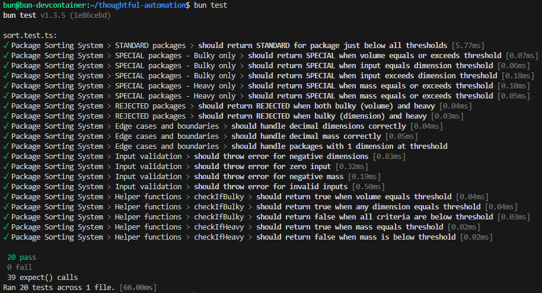

# Getting Started

## Assignment

This is a coding exercise outlined by the Core Technical Screening Team at Thoughtful Automation. For reference, the assignment is [outlined here](https://thoughtfulautomation.notion.site/Core-Engineering-Technical-Screen-b61b6f6980714c198dc49b91dd23d695).

## Setup

1. To get started, clone the following [bun devcontainer](https://github.com/jmgogo/bun-devcontainer). Please reference it's README.

Don't get overwhelmed if you are unfamiliar with running devcontainers. Just make sure you have a containers daemon (Docker Desktop, Podman, etc), and add the [remote development extension](https://marketplace.visualstudio.com/items?itemName=ms-vscode-remote.vscode-remote-extensionpack) pack to vscode. Once you do, you can launch the devcontainer with the command terminal (Ctrl+Shift+P) and run `Dev Container: Rebuild and Reopen in Dev Container`.

2. Simply use the `bun` branch in that repository and hop into the devcontainer. Once inside, clone this repo and you're ready to go!

## Running the Tests

1. Install project dependencies

```bash
bun install
```

2. Run the tests

```bash
bun test
```



3. Celebrate 🥳
